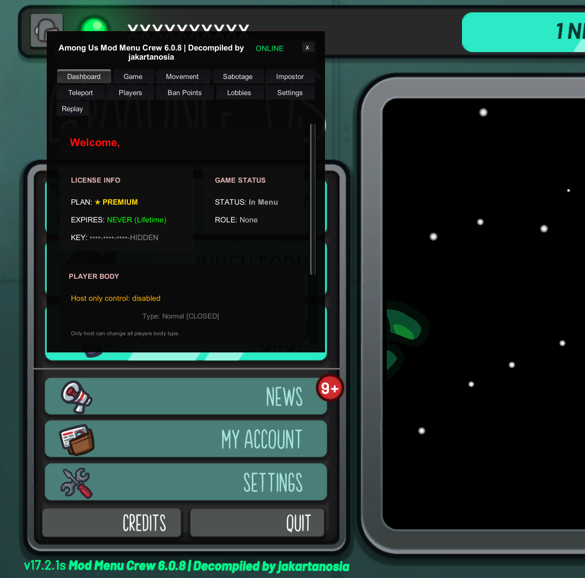

# Decompiled with love by jakartanosia & arocimorr
## Project Status
## ⚠️ THIS IS THE STEAM DECOMPILED VERSION!
Shouldn't be hard to make it work on Ms Store too
## our discord join to talk to us :) https://discord.gg/V3GNBHxN

This project is currently not fully stable. As it was created through a decompilation process, some features may be incomplete or not function as originally intended.
However, several patches and adjustments have been implemented to ensure that most core functionalities are operational.

Contributions & Issue Reporting

Contributions are welcome.

If you are interested in collaborating to decompile newer updates from ModMenuCrew, please open an issue to discuss.
Bug reports, suggestions, and improvement proposals can also be submitted through the Issues section. I will review and address them whenever possible.

Feel free to clone and fork the repository, just don't be a unskilled skid and make a closed source version with unskilled key systems
## Purpose of This Project

This project was created due to concerns regarding the key-based protection system used by ModMenuCrew. In my view, the level of protection applied is excessive for a simple Among Us BepInEx plugin that skidded malum menu source

It will be open source forever and is also a tribute to Malum Menu, the open source project that ModMenuCrew skids cloned and made private, have fun modding!
